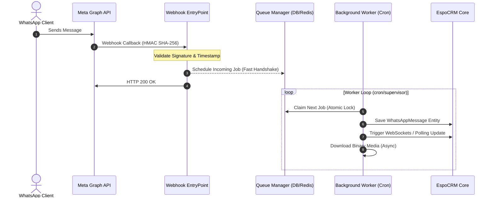

# 💬 EspoCRM WhatsApp Cloud API Enterprise Integration

A production-grade, upgrade-safe, and highly performant WhatsApp Cloud API (Meta WABA) omnichannel communication suite developed natively for **EspoCRM**. Secure, observable, SaaS-ready, and optimized for high-volume enterprise communications.

---

## 🏗️ Architecture Overview

The integration leverages a decoupled, asynchronous, and self-healing backend queue architecture to handle thousands of real-time messages and template broadcasts without overloading web processes.



---

## 💎 Features Checklist

### 1. Unified Omnichannel Inbox
*   **Real-time Feed**: Frosted, glassmorphic layout updates featuring typing indicators, read receipts, and delivery logs.
*   **Canned Snippets**: `/` prefix triggers to inject automated canned response texts instantly.
*   **Agent Internal Notes**: Yellow-tinted internal memo bubbles excluded from Meta outgoing dispatches.
*   **Sidebar Mapping**: Dynamically links active WhatsApp phone numbers to Espo Contacts, Leads, or Accounts.

### 2. Enterprise Queue & Worker Infrastructure
*   **Decoupled Worker Routing**: Direct database fallback queues and Redis cache indices support.
*   **Fail-Safe Backoff**: Reschedules failed Meta API dispatches utilizing dynamic exponential delays.
*   **Dead-Letter Queue (DLQ)**: Automatically flags and isolates persistent failures after 3 retry attempts.
*   **Heartbeat Monitor**: Automatically terminates and recycles workers if execution memory limits exceed 85%.

### 3. Smart Sticky Agent System
*   **Sticky Routing**: Locks conversations to the primary CRM contact owner, routing replies to their inbox.
*   **Round-Robin Failover**: Automatically rotates owner assignments among active online agents if no sticky mapping is found.
*   **Anti-Collision Lock**: Database transaction rows locks prevent multiple agents from claiming the same conversation simultaneously.
*   **Audit Logging**: Automatically logs system-level handoffs directly within the chat timeline.

### 4. GDPR Compliance & Data Governance
*   **Retention Purge Core**: Weekly crons chunk historical message logs and delete corresponding S3 or local attachments securely.
*   **Consent Logs**: Unalterable auditing of customer opt-in/opt-out status directly on the conversation record.
*   **SaaS Preparedness**: Abstractions mapping isolated tenant folders on S3, dedicated tenant queues, and configurations.

---

## 📸 Screenshots Directory

Below are the mapped visual dashboards of the omnichannel client suite:

| Feature Viewport | Interface Showcase |
| :--- | :--- |
| **Omnichannel Inbox** |  |
| **Campaign Scheduler** |  |
| **Diagnostics Panel** |  |
| **Admin Configuration** |  |

---

## 🛠️ Technology Stack & Dependencies

*   **Core Logic**: PHP 8.2 / 8.3 Natively
*   **Database**: MySQL 8.0+ / MariaDB 10.5+
*   **Caching & Queue**: Redis 6.2+
*   **Web Framework**: EspoCRM Core API Framework
*   **Observability**: Prometheus telemetry version 0.0.4, standard error logger
*   **Reverse Proxy**: Nginx with SSL hardening and HTTP/2

---

## 🚀 Step-by-Step Installation Guide

### Step 1: Upload and Install the Extension Bundle
1.  Download the certified package **`whatsapp-integration-1.0.0.zip`**.
2.  Log in to your EspoCRM portal as an administrator.
3.  Go to **Administration -> Extensions -> Upload**.
4.  Upload the ZIP file and click **Install**. The module automatically registers metadata scopes and routes cache maps.

### Step 2: Configure Environment Variables
Define these global values within your CRM configuration file (`data/config.php`) or Docker environment limits:

| Environment Variable Key | Type | Default | Description |
| :--- | :--- | :--- | :--- |
| `ESPO_TENANT_ID` | String | `default` | SaaS Tenant Context Identifier. |
| `WHATSAPP_RETENTION_DAYS` | Integer | `180` | Days to preserve historical message data (GDPR compliance). |
| `WHATSAPP_S3_ENABLED` | Boolean | `false` | Enable AWS S3 storage private buckets. |
| `WHATSAPP_ROUTING_RULE` | String | `StickyAgent` | Active assignment routing rule (`StickyAgent`, `RoundRobin`). |

### Step 3: Setup Redis Caching
Optimize `/etc/redis/redis.conf` settings to protect active queue indices:
```ini
maxmemory 512mb
maxmemory-policy volatile-lru
appendonly yes
appendfsync everysec
```

### Step 4: Configure Supervisor Workers
Save the following supervisor recipe to `/etc/supervisor/conf.d/espo-whatsapp.conf` to run high-throughput persistent queues safely:

```ini
[program:espo-whatsapp-worker]
command=php /var/www/html/bin/cron.php --run-whatsapp-queue
directory=/var/www/html
autostart=true
autorestart=true
numprocs=2
process_name=%(program_name)s_%(process_num)02d
user=www-data
redirect_stderr=true
stdout_logfile=/var/log/espo-whatsapp-worker.log
stdout_logfile_maxbytes=10MB
stdout_logfile_backups=5
```

---

## 🐳 Docker Production Compose Recipe

Spin up a production-ready, observable, and isolated environment using the compose structure below:

```yaml
version: '3.8'

services:
  espo_app:
    image: espocrm/espocrm:latest
    container_name: espo_web
    restart: always
    environment:
      - ESPO_CONFIG_CACHE_BACKEND=Redis
      - ESPO_CONFIG_REDIS_HOST=espo_cache
    volumes:
      - espo_data:/var/www/html
    depends_on:
      - espo_db
      - espo_cache

  espo_worker:
    image: espocrm/espocrm:latest
    container_name: espo_supervisor_queue
    restart: always
    command: /usr/bin/supervisord -n -c /etc/supervisor/supervisord.conf
    volumes:
      - espo_data:/var/www/html
      - ./supervisor/espo-whatsapp.conf:/etc/supervisor/conf.d/espo-whatsapp.conf
    depends_on:
      - espo_app

  espo_cache:
    image: redis:6.2-alpine
    container_name: espo_cache
    restart: always
    command: redis-server --maxmemory 256mb --maxmemory-policy volatile-lru --appendonly yes
    volumes:
      - redis_data:/data

  espo_db:
    image: mariadb:10.11
    container_name: espo_db
    restart: always
    environment:
      - MYSQL_DATABASE=espo_db
      - MYSQL_USER=espo_user
      - MYSQL_PASSWORD=secure_password
      - MYSQL_ROOT_PASSWORD=secure_root_password
    volumes:
      - db_data:/var/lib/mysql

volumes:
  espo_data:
  db_data:
  redis_data:
```

---

## 📈 Monitoring & Real-time Metrics

The diagnostics endpoint `/WhatsApp/diagnostics?format=prometheus` is Prometheus-scrapable.

### Target Metrics Config (`prometheus.yml`)
```yaml
scrape_configs:
  - job_name: 'espo-waba-telemetry'
    scrape_interval: 10s
    metrics_path: '/entry-point/WhatsAppDiagnostics'
    params:
      format: ['prometheus']
    static_configs:
      - targets: ['espo-crm.yourcompany.com']
```

---

## 🧪 Standsalone Testing Suite

Verify database parameters, cryptographic functions, signature calculations, and placeholder merges dynamically before shipping upgrades:

```bash
# Execute standalone testing dashboard
php tests/run_tests.php
```

---

## 🤝 Open-Source Contributor Code

*   All code contributions must adhere to **PSR-12** guidelines.
*   Branch naming patterns: `feat/waba-...` or `fix/waba-...`
*   Indentation sizes: Strictly set at **4 spaces** for PHP, **2 spaces** for JSON configurations.

---

## 🗺️ Roadmap & Multi-Channel Milestones

1.  **Phase 1 (Completed)**: Meta WABA API integration, secure AES vault, diagnostics bundles, and GDPR purges.
2.  **Phase 2**: Multi-Channel unified support inbox (Messenger, Instagram Direct Message integration).
3.  **Phase 3**: Dynamic AI-Assistant chatbot automated hook mappings.
4.  **Phase 4**: Voice note audio conversions (transcriptions parsing using Whispers models).

---

## 📄 License

Distributed under the MIT Open-Source License. See [LICENSE](LICENSE) file for complete details.

## 💎 Credits

*   **EspoCRM Team** for their outstanding, upgrade-safe framework.
*   **Meta Developer Team** for the WhatsApp Business Graph API.
*   **Prometheus Team** for telemetry specifications.
